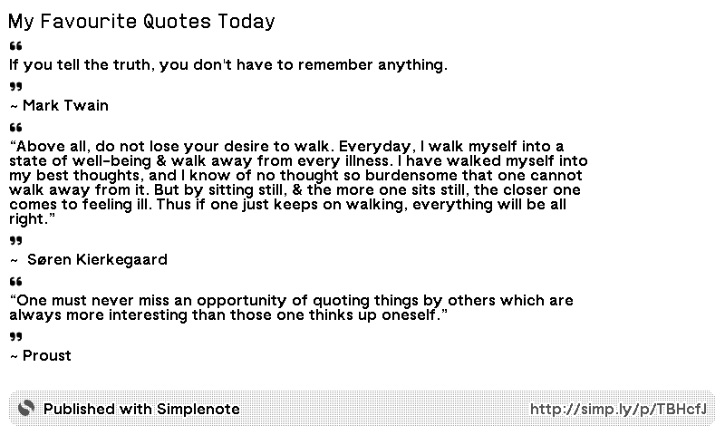

# trmnl-simplenote

A Simplenote to TRMNL Plugin, easily display a Simplenote on your TRMNL e-ink screen!

## Setup

1. `brew install rbenv`
2. `brew install firefox@nightly` (if doing screen renders)
3. `brew install ImageMagick` (if doing screen renders)
4. `rbenv init`
5. `rbenv local`
6. `bundler install`
7. `npm install`
8. `npx playwright install`
9. `APP_ENV=production trmnlp serve`
10. `npx playwright test`

## Pushing changes to TRMNL

1. `trmnlp login`
2. `trmnlp push`
